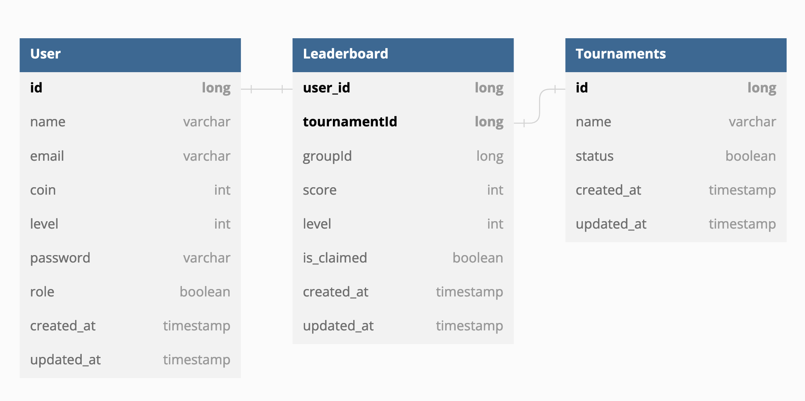

## Row-Match Case Study

### Requirements

    Java 8 or later
    Maven 3.x
    Spring Boot 2.x


### How to run the code
Clone the project repository to your local machine


```
git clone https://github.com/emres8/row-match.git
```


Navigate to the project directory


```
cd row-match
```

Update application.yml configs to connect databases

Run mysql and redis servers in seperate shell tabs, for my case:
```
mysql -u root -p
```

and
```
redis-server
```

Run the Spring Boot application
```
mvn spring-boot:run
```

Compile and package the project using Maven

```
mvn clean package
```

The application should now be running and accessible at http://localhost:8080. <br>
#### How to execute the tests

To execute the unit tests, run the following command: <br>
(May not work for some reason couldn't connect ApplicationTest class with other test classes. <br>
Can execute test classes one by one but couldn't execute via mvn)

```
mvn test
```

This will run all the test cases included in the project.

### Design of the Project



#### Further Potential Improvements
* For validating request and response types and throwing exceptions when necessary could be improved throughout to project. 
* To handle concurrency project uses @Transactional annotation to get, but using Locks (optimistic or pessimistic) or using threads may be a better solution for ensuring the reliability of operations.
* Tests don't measure efficiency that design choice suggests such as SQL indexing, usage of Redis Cache. Surely, testing on performance would yield potential improvements on design and code overall. Also only implemented for service layer, should be expanded.


